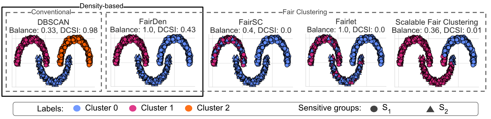
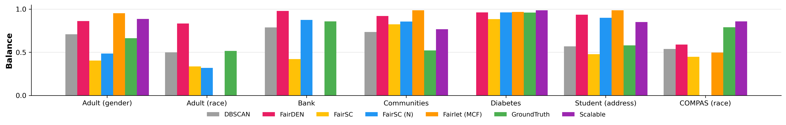
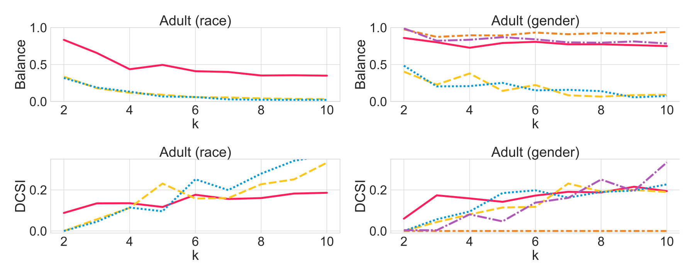
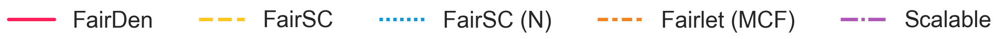
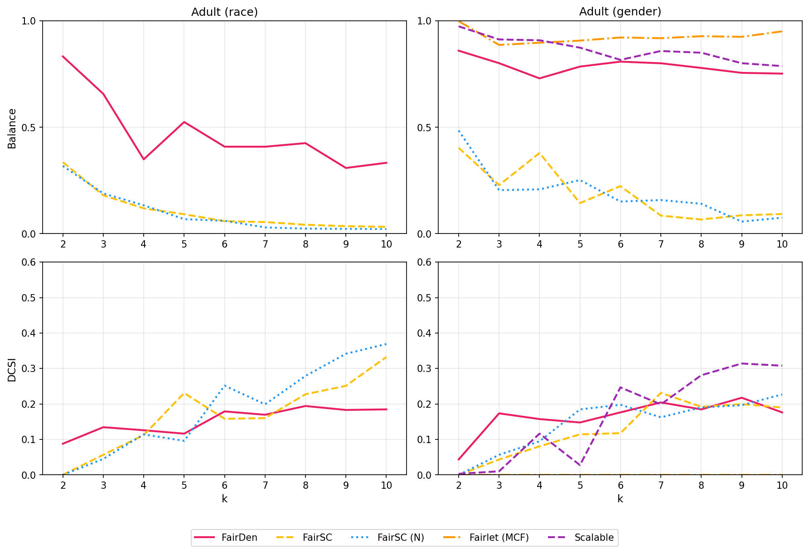
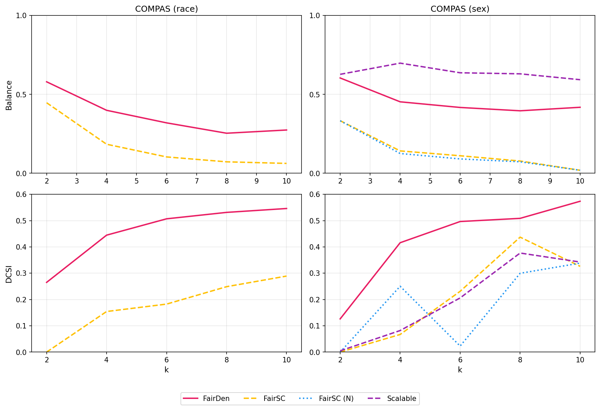

# FairDen: Phân cụm dựa trên mật độ công bằng

Repository này là bản triển khai chính thức của [FairDen: Fair Density-Based Clustering](https://iclr.cc/virtual/2025/poster/29171), được chấp nhận tại ICLR 2025.

---

## 🔄 Thông tin Fork

Repository này là **bản fork và mở rộng** từ bản triển khai FairDen gốc của các tác giả. Nó đã được sử dụng, mở rộng và thực nghiệm lại bởi nhóm sinh viên tại **Trường Đại học Khoa học tự nhiên (HCMUS), Đại học Quốc gia TP. Hồ Chí Minh**.

### Thành viên nhóm
- **Phan Nhựt Anh** - MSSV: 23127023
- **Nguyễn Hoàng Quân** - MSSV: 23127106
- **Thái Hoàng Phúc** - MSSV: 23127458

### Bổ sung của nhóm:

| File | Mô tả |
|------|-------|
| `src/experiments/compas_experiment.py` | Thực nghiệm trên tập dữ liệu COMPAS (dự đoán tái phạm) |
| `src/experiments/student_experiment.py` | Thực nghiệm trên tập dữ liệu Student Performance |
| `src/experiments/compas_hyperparam_search.py` | Tối ưu hóa siêu tham số cho tập COMPAS |
| `src/experiments/student_hyperparam_search.py` | Tối ưu hóa siêu tham số cho tập Student |
---

## Three moons (Ba trăng khuyết)



## Hướng dẫn cài đặt
Yêu cầu: Python 3.9 
```bash
pip install -r requirements.txt
```

## Các thực nghiệm
### Tìm kiếm siêu tham số

Tối ưu hóa tham số DBSCAN cho các tập dữ liệu COMPAS và Student Performance được nhóm thêm vào dựa trên Methodology của tác giả.

#### Cách chạy thực nghiệm
```python
from src.experiments.compas_hyperparam_search import compas_hyperparam_search
from src.experiments.student_hyperparam_search import student_hyperparam_search

def main():
    compas_hyperparam_search()   # Cho tập COMPAS
    student_hyperparam_search()  # Cho tập Student
```

### Thực nghiệm Real World
#### Kết quả của tác giả trong bài báo gốc:


#### Kết quả của nhóm:

#### Cách chạy thực nghiệm
```python
from src.experiments.realworld_experiment import realworld_experiment
def main():
    realworld_experiment()
if __name__ == "__main__":
    main()
```

### Thực nghiệm k-line
#### Kết quả của tác giả trong bài báo gốc:


#### Kết quả của nhóm:

#### Kết quả trên tập dữ liệu COMPAS:

#### Cách chạy thực nghiệm
```python
from src.experiments.adult_experiment import adult_experiment
from src.experiments.compas_experiment import compas_experiment
def main():
    adult_experiment() # Thực nghiệm trên tập dữ liệu Adult (của tác giả)
    compas_experiment() # Thực nghiệm trên tập dữ liệu COMPAS (bổ sung của nhóm)
if __name__ == "__main__":
    main()
```

### Thực nghiệm Categorical (Biến phân loại)

Chỉnh sửa hàm main như sau:
```python
from src.experiments.categorical_experiments import categorical_experiments
def main():
    categorical_experiments()
if __name__ == "__main__":
    main()
```

---

## Cấu trúc thư mục

```bash
.
├── auxiliary                       # File phụ trợ: biểu đồ, thực nghiệm bổ sung, tối ưu tham số
│   ├── AuxExperiments              # Thực nghiệm runtime và three moons
│   ├── Parameters                  # Kết quả tối ưu tham số
│   └── Plots                       # Biểu đồ
│
├── config  
│   ├── realworld                   # File cấu hình cho tập dữ liệu thực tế
│   └── three_moons                 # File cấu hình cho tập three moons
│
├── data  
│   └── realworld                   # Các tập dữ liệu thực tế
│
├── results                         # Kết quả thực nghiệm
│   ├── rw_experiment               # Kết quả Real-world
│   ├── compas_experiment           # Kết quả COMPAS (bổ sung của chúng tôi)
│   └── student_experiment          # Kết quả Student (bổ sung của chúng tôi)
│              
├── src
│   ├── comparative_methods         # Triển khai các phương pháp so sánh
│   ├── dc_dist                     # Khoảng cách dc_distance
│   ├── evaluation                  # Đánh giá: balance, dcsi, tỷ lệ noise
│   ├── experiments                 # Các thực nghiệm
│   ├── utils                       # DataLoader, DataEncoder
│   └── FairDen.py                  # Phương pháp FairDen
│
├── scripts                         # Script tiện ích (bổ sung của chúng tôi)
│   └── visualize_balance.py        # Script trực quan hóa Balance
│
├── visualization                   # Thư mục lưu biểu đồ (bổ sung của chúng tôi)
│ 
├── .gitignore                      # File ignore cho Git
├── LICENSE                         # File giấy phép  
├── main.py                         # File chính để gọi các thực nghiệm  
├── README.md                       # Mô tả dự án   
└── requirements.txt                # Các thư viện phụ thuộc  
```

## Trích dẫn
Nếu bạn sử dụng phương pháp hoặc mã nguồn từ repository này, vui lòng trích dẫn bài báo của chúng tôi:

Lena Krieger*, Anna Beer*, Pernille Matthews, Anneka Myrup Thiesson, Ira Assent, (2025, April). FairDen: Fair Density-based Clustering. Accepted for publication at the *Thirteenth International Conference on Learning Representations (ICLR)*.

```bibtex
@unpublished{kriegerbeer2025fairden,
  title        =    {FairDen: Fair Density-based Clustering},
  author       =    {Krieger*, Lena and Beer*, Anna and Matthews, Pernille and Thiesson, Anneka Myrup and Assent, Ira},
  url          =    {https://openreview.net/forum?id=aPHHhnZktB},
  year         =    {2025},
  note         =    {Accepted for publication at The Thirteenth International Conference on Learning Representations,
                    (ICLR) 2025}
}
```

## Giấy phép

### Mã nguồn
Công trình này được cấp phép theo [Apache 2.0 License](LICENSE). Giấy phép này áp dụng cho tất cả các file mã nguồn do chúng tôi triển khai.

### Dữ liệu
Các tập dữ liệu sau được lấy từ [UC Irvine Machine Learning Repository](https://archive.ics.uci.edu/) và được cấp phép theo [Creative Commons Attribution 4.0 International (CC BY 4.0)](https://creativecommons.org/licenses/by/4.0/legalcode):
- Tập Bank
- Tập Communities and Crime
- Tập Diabetic
- Tập UCI Census
- Tập COMPAS (ProPublica)
- Tập Student Performance

Dữ liệu do chúng tôi tạo bằng [DENSIRED](https://github.com/PhilJahn/DENSIRED) hoặc tập three moons được cấp phép theo [Creative Commons Zero (CC0)](https://creativecommons.org/public-domain/cc0/).


<!-- MARKDOWN LINKS & IMAGES -->

[license-shield]: https://img.shields.io/github/license/othneildrew/Best-README-Template.svg?style=for-the-badge
[license-url]: https://github.com/othneildrew/Best-README-Template/blob/master/LICENSE.txt
